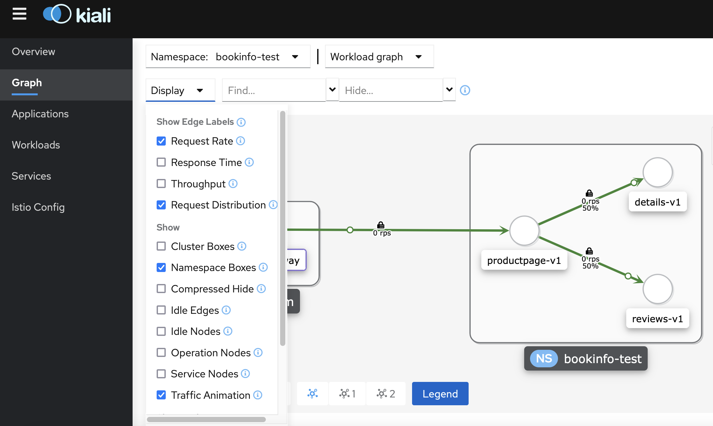
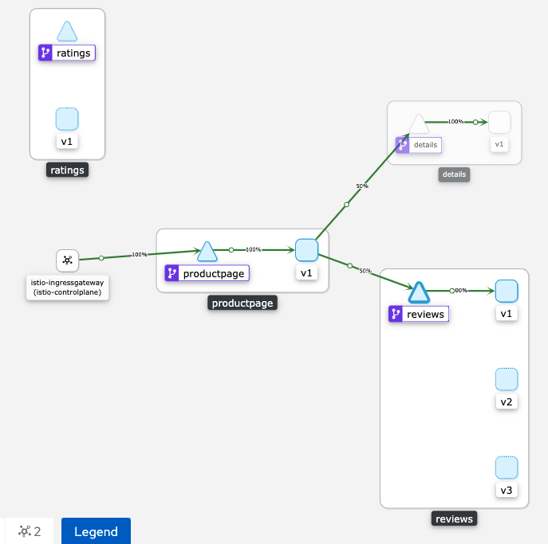
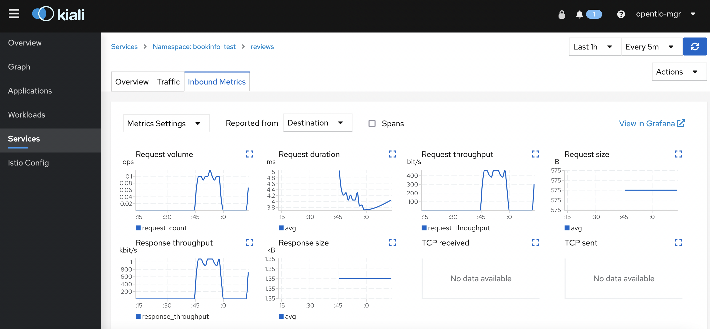

# Example GitOps-managed Service Mesh

Use this repository as a starting point to manage a Service Mesh on an OpenShift cluster.

## Getting Started

1. Clone this example repository.

2. Configure the example ArgoCD `Application` by providing your new repository URL `spec.source.repoURL` in the following file:

    ```
    bootstrap/instance/application.yaml
    ```

3. Provision the ArgoCD operator:
    
    ```
    oc apply -k bootstrap/operator
    ```

4. Provision the ArgoCD `Application`:

    ```
    oc apply -k bootstrap/instance
    ```

## Observation

The demo bootstrap initiates a default ArgoCD instance hosted in the `openshift-gitops` namespace. In this namespace a `Route` is deployed which provides a URL to the ArgoCD console.


## Onboarding an application to the Service Mesh

The following sections will describe how to manage applications deployed to the Service Mesh with this GitOps framework.

### Requesting a new namepaces


### Adding namespaces to a ServiceMeshMemberRoll


### Adding ArgoCD Applications (bookinfo example)


### Validating the bookinfo example

Use Kiali to visualize bookinfo traffic:

```
KIALI_URL=$(oc get route kiali -n istio-system -o jsonpath='{.spec.host}')
```
Or using openshift console: Networking->Routes->kiali

Open the URL on a browser and then click on the `bookinfo` app:


Make sure all services are healthy:


Call the `productinfo` page:
```
BOOK_GW=$(oc get route istio-ingressgateway -n istio-system -o jsonpath="{.spec.host}{.spec.path}")
```
```
curl -v $BOOK_GW/productpage | grep '<title>Simple Bookstore App</title>'
```

Setup Kiali for traffic visualization by going to the left menu `Graph` then click on the drop down `Display` and select the `Request Percentage` and `Traffic Animation` options:


Now lets do a loop to generate requests to be able to watch the animation:
```
while true; \
do curl $BOOK_GW/productpage | grep "< HTTP/1.1"; \
sleep 1;done
```
Enter Control-C to stop the script.

Switch to the graph and watch the animation, observe how the requests are mostly balanced between the three versions of the reviews service:


Select the reviews service by clicking on the node and observe on the right the incoming traffic:


Now we are going to redirect all traffic to the v1 services by creating the `VirtualService` and `DestinationRules`, let start with the former which looks like:
```
apiVersion: networking.istio.io/v1alpha3
kind: DestinationRule
metadata:
  name: reviews
spec:
  host: reviews
  subsets:
  - name: v1
    labels:
      version: v1
  - name: v2
    labels:
      version: v2
  - name: v3
    labels:
      version: v3
```
Now apply them all:
```
oc apply -f https://raw.githubusercontent.com/maistra/istio/maistra-2.1/samples/bookinfo/networking/destination-rule-all.yaml -n bookinfo
```

Now lets review the corresponding `VirtualService`s:
```
apiVersion: networking.istio.io/v1alpha3
kind: VirtualService
metadata:
  name: reviews
spec:
  hosts:
    - reviews
  http:
    - route:
        - destination:
            host: reviews
            subset: v1
```
Now Apply:
```
oc apply -f https://raw.githubusercontent.com/maistra/istio/maistra-2.1/samples/bookinfo/networking/virtual-service-all-v1.yaml -n bookinfo
```

The combination of the above Virtual Services and destination Rules will enforce that `bookinfo` anonymous users all use v1 of all services.

Run the loop again and switch to the traffic animation:
```
while true; \
do curl $BOOK_GW/productpage; \
sleep 3;done
```
You should see now something like this:


If you want to inspect traffic metrics even further, go to the left menu named `Services` and select the `reviews` service, then click on the `Inbound Metrics` tab:


In the same Kiali service view you have the ability to see more in detail metrics by jumping to Grafana, click on the blue link that reads `View in Grafana` and expect something like this:


### Validating bookinfo summary
- We have shown how to use Kiali to monitor and visualize workload traffic
- Additional target routing can be done using DestinationRule

